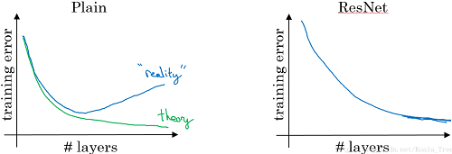

# Deep convolutional models
### 1
Which of the following do you typically see as you move to deeper layers in a ConvNet?

nH and nW increases, while nC decreases

nH and nW decreases, while nC also decreases

nH and nW increases, while nC also increases

**nH and nW decrease, while nC increases**

经典模式：随着网络的深度增加，图像的大小在缩小，与此同时，通道的数量却在增加

### 2
Which of the following do you typically see in a ConvNet? (Check all that apply.)

**Multiple CONV layers followed by a POOL layer**

Multiple POOL layers followed by a CONV layer

**FC layers in the last few layers**

FC layers in the first few layers

多个卷积层后跟着一个池化层；几乎所有的网络结构都是在最后几层使用全连接

### 3
In order to be able to build very deep networks, we usually only use pooling layers to downsize the height/width of the activation volumes while convolutions are used with “valid” padding. Otherwise, we would downsize the input of the model too quickly.

True

**False**

### 4
Training a deeper network (for example, adding additional layers to the network) allows the network to fit more complex functions and thus almost always results in lower training error. For this question, assume we’re referring to “plain” networks.

True

**False**

训练层数的增加并不一定会带来更小的误差。	
没有“short cut”的普通神经网络和ResNet的误差曲线：

- 在没有残差的普通神经网络中，训练的误差实际上是随着网络层数的加深，先减小再增加；
- 在有残差的ResNet中，即使网络再深，训练误差都会随着网络层数的加深逐渐减小。ResNet对于中间的激活函数来说，有助于能够达到更深的网络，解决梯度消失和梯度爆炸的问题。

### 5
The following equation captures the computation in a ResNet block. What goes into the two blanks above?

a[l+2]=g(W[l+2]g(W[l+1]a[l]+b[l+1])+bl+2+_______ )+_______

**a[l] and 0, respectively**

0 and z[l+1], respectively

z[l] and a[l], respectively

0 and a[l], respectively

$a^{[l+2]} = g(z^{[l+2]}+a^{[l]})=g(W^{[l+2]}a^{[l+1]}+b^{[l+2]}+a^{[l]})$

### 6
Which ones of the following statements on Residual Networks are true? (Check all that apply.)

**Using a skip-connection helps the gradient to backpropagate and thus helps you to train deeper networks**

A ResNet with L layers would have on the order of L2 skip connections in total.

The skip-connections compute a complex non-linear function of the input to pass to a deeper layer in the network.

**The skip-connection makes it easy for the network to learn an identity mapping between the input and the output within the ResNet block.**

### 7
Suppose you have an input volume of dimension 64x64x16. How many parameters would a single 1x1 convolutional filter have (including the bias)?

2

4097

1

**17**

### 8
Suppose you have an input volume of dimension nH x nW x nC. Which of the following statements you agree with? (Assume that “1x1 convolutional layer” below always uses a stride of 1 and no padding.)

**You can use a 1x1 convolutional layer to reduce nC but not nH, nW.**

You can use a 1x1 convolutional layer to reduce nH, nW, and nC.

**You can use a pooling layer to reduce nH, nW, but not nC.**

You can use a pooling layer to reduce nH, nW, and nC.

### 9
Which ones of the following statements on Inception Networks are true? (Check all that apply.)

**A single inception block allows the network to use a combination of 1x1, 3x3, 5x5 convolutions and pooling.**

Making an inception network deeper (by stacking more inception blocks together) should not hurt training set performance.

**Inception blocks usually use 1x1 convolutions to reduce the input data volume’s size before applying 3x3 and 5x5 convolutions.**

Inception networks incorporates a variety of network architectures (similar to dropout, which randomly chooses a network architecture on each step) and thus has a similar regularizing effect as dropout.

### 10
Which of the following are common reasons for using open-source implementations of ConvNets (both the model and/or weights)? Check all that apply.

A model trained for one computer vision task can usually be used to perform data augmentation even for a different computer vision task.

**It is a convenient way to get working an implementation of a complex ConvNet architecture.**

The same techniques for winning computer vision competitions, such as using multiple crops at test time, are widely used in practical deployments (or production system deployments) of ConvNets.

**Parameters trained for one computer vision task are often useful as pretraining for other computer vision tasks.**

可以更方便的实现该网络，有些时候有些权重参数可以直接拿来使用