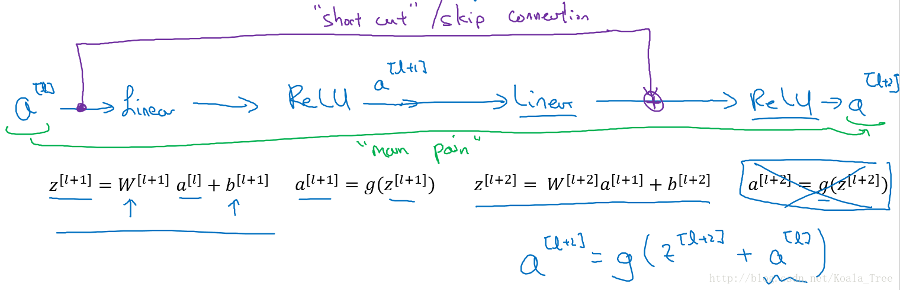

## 卷积神经网络 — **深度卷积模型**

介绍几种经典的卷积神经网络结构，分别是LeNet、AlexNet、VGGNet。

**LeNet-5：** 
LeNet-5主要是针对灰度设计的，所以其输入较小，为32×32×1，其结构如下：

在LetNet中，存在的经典模式：

- 随着网络的深度增加，图像的大小在缩小，与此同时，通道的数量却在增加；
- 每个卷积层后面接一个池化层。

**AlexNet：**

AlexNet直接对彩色的大图片进行处理，其结构如下：

- 与LeNet相似，但网络结构更大，参数更多，表现更加出色；
- 使用了Relu；
- 使用了多个GPUs；
- LRN（后来发现用处不大，丢弃了）

AlexNet使得深度学习在计算机视觉方面受到极大的重视。

**VGG-16：**

VGG卷积层和池化层均具有相同的卷积核大小，都使用3×3，stride=1,SAME的卷积和2×2，stride=2的池化。其结构如下：

### 2. ResNet

ResNet是由残差块所构建。

**残差块：**

下面是一个普通的神经网络块的传输：

其前向传播的计算步骤为：

- Linear：$z^{[l+1]} = W^{[l+1]}a^{[l]} + b^{[l+1]}$
- Relu：$a^{[l+1]} = g(z^{[l+1]})$
- Linear：$z^{[l+2]} = W^{[l+2]}a^{[l+1]} + b^{[l+2]}$
- Relu：$a^{[l+2]} = g(z^{[l+2]})$

而ResNet块则将其传播过程增加了一个从$a^{[l]}$直接到$z^{[l+2]}$的连接，将其称之为“short cut”或者“skip connection”：

也就是前向传播公式的最后一个步骤变为： $a^{[l+2]} = g(z^{[l+2]}+a^{[l]})$

增加“short cut”后，成为残差块的网络结构：

注意这里是连接在Relu激活函数之前。

**Residual Network：**

多个**残差块**堆积起来构成ResNet网络结构，其结构如下：

没有“short cut”的普通神经网络和ResNet的误差曲线：

- 在没有残差的普通神经网络中，训练的误差实际上是随着网络层数的加深，先减小再增加；
- 在有残差的ResNet中，即使网络再深，训练误差都会随着网络层数的加深逐渐减小。

ResNet对于中间的激活函数来说，有助于能够达到更深的网络，解决梯度消失和梯度爆炸的问题。

### 3. ResNet表现好的原因

假设有个比较大的神经网络，输入为x，输出为a[l]。如果我们想增加网络的深度，这里再给网络增加一个残差块：

假设网络中均使用Relu激活函数，所以最后的输出a⩾0。这里我们给出$a^{[l+2]}$的值：

$a^{[l+2]} = g(z^{[l+2]}+a^{[l]})=g(W^{[l+2]}a^{[l+1]}+b^{[l+2]}+a^{[l]})$

如果使用L2正则化或者权重衰减，会压缩W和b的值，如果$W^{[l+2]}=0$同时$b^{[l+2]}=0$，那么上式就变成：

$a^{[l+2]} = g(z^{[l+2]}+a^{[l]})=g(a^{[l]})=relu(a^{[l]})= a^{[l]}$

所以从上面的结果我们可以看出，对于残差块来学习上面这个恒等函数是很容易的。所以在增加了残差块后更深的网络的性能也并不逊色于没有增加残差块简单的网络。所以尽管增加了网络的深度，但是并不会影响网络的性能。同时如果增加的网络结构能够学习到一些有用的信息，那么就会提升网络的性能。

同时由于结构$a^{[l+2]} =g(z^{[l+2]}+a^{[l]})$，ResNet在设计中使用了很多相同的卷积，以保持$z^{[l+2]}$和$a^{[l]}$的维度相同。

将普通深度神经网络变为ResNet：

在两个相同的卷积层之间增加“skip connection”。

### 4. 1x1卷积

**1x1卷积：**

在二维上的卷积相当于图片的每个元素和一个卷积核数字相乘。

但是在三维上，与1×1×nC卷积核进行卷积，相当于三维图像上的1×1×nC的切片，也就是nC个点乘以卷积数值权重，通过Relu函数后，输出对应的结果。而不同的卷积核则相当于不同的隐层神经元结点与切片上的点进行一一连接。

根本上1×1卷积核相当于对一个切片上的nC个单元都应用了一个全连接的神经网络。

最终三维的图形应用1×1的卷积核得到一个相同长宽但第三维度变为卷积核个数的图片。

**1x1卷积应用：**

- 维度压缩：使用目标维度的1×1的卷积核个数。
- 增加非线性：保持与原维度相同的1×1的卷积核个数。

### 5. Inception Network

Inception Network 的作用就是使我们无需去考虑在构建深度卷积神经网络时，使用多大的卷积核以及是否添加池化层等问题。

**Inception主要结构：**

在上面的Inception结构中，应用了不同的卷积核，以及带padding的池化层。在保持输入图片大小不变的情况下，通过不同运算结果的叠加，增加了通道的数量。

**计算成本的问题：**

对于上面的5×5大小卷积核的计算成本：

- 1 filters：5×5×192；
- 32 个 filters；
- 总的计算成本：28×28×32×5×5×192=120M

对于1×1大小卷积核用作过渡的计算成本，也将下面的中间的层叫做“bottleneck layer”：

- 1×1卷积层计算成本：28×28×16×1×1×192=2.4M
- 5×5卷积层计算成本：28×28×32×5×5×16=10.0M
- 总的计算成本：2.4M+10.0M=12.4M

所以1×1卷积核作为bottleneck layer”的过渡层能够有效减小卷积神经网的计算成本。事实证明，只要合理地设置“bottleneck layer”，既可以显著减小上层的规模，同时又能降低计算成本，从而不会影响网络的性能。

**Inception 模块：**

将上面说介绍的两种主要思想和模式结合到一起构成 Inception 模块，如下：

**Inception Network：**

多个Inception 模块的堆叠构成Inception Network，下面是GoogleNet的结构：

### 6. 迁移学习

**小数据集：**

如今在深度学习领域，许多研究者都会将他们的工作共享到网络上。在我们实施自己的工作的时候，比如说做某种物体的识别分类，但是只有少量的数据集，对于从头开始训练一个深度网络结构是远远不够的。

但是我们可以应用迁移学习，应用其他研究者建立的模型和参数，用少量的数据仅训练最后自定义的softmax网络。从而能够在小数据集上达到很好的效果。

**大数据集：**

如果我们在自己的问题上也拥有大量的数据集，我们可以多训练后面的几层。总之随着数据集的增加，我们需要“ freeze”的层数越来越少。最后如果我们有十分庞大的数据集，那么我们可以训练网络模型的所有参数，将其他研究者训练的模型参数作为参数的初始化来替代随机初始化，来加速我们模型的训练。

### 7. 数据扩充

与其他机器学习问题相比，在计算机视觉领域当下最主要的问题是没有办法得到充足的数据。所以在我们训练计算机数据模型的时候，数据的扩充就是会非常有用。

**数据扩充的方法：**

- 镜像翻转（Mirroring）；
- 随机剪裁（Random Cropping）；
- 色彩转换（Color shifting）： 
  为图片的RGB三个色彩通道进行增减值，如（R：+20，G：-20，B：+20）；PCA颜色增强：对图片的主色的变化较大，图片的次色变化较小，使总体的颜色保持一致。

**训练过程中的数据扩充：**